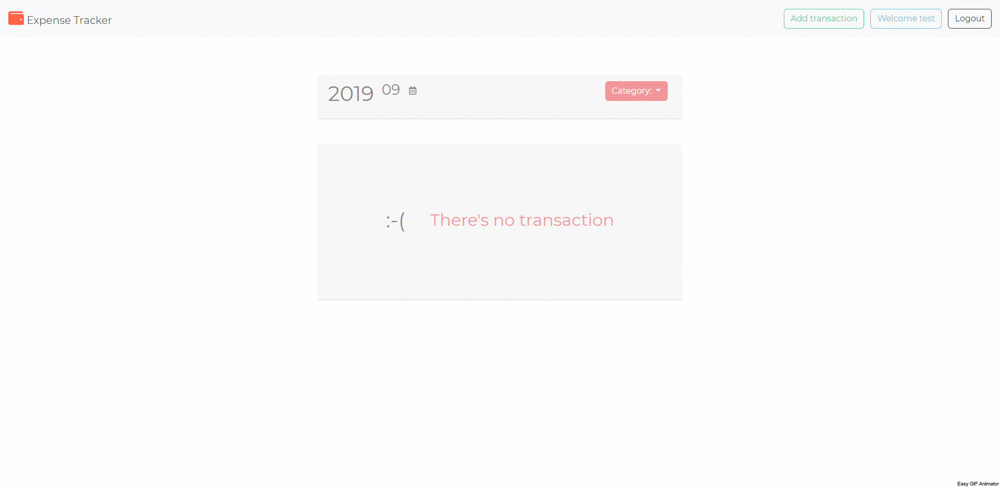

# Expense tracker
**[Heroku demo](https://expense-tracker-mina.herokuapp.com/)**

This is an expense tracker demo which built up from [Alphacamp](https://tw.alphacamp.co/) semester 3 assignment.



## Feature
1. Show transactions group by date and month.
2. Filter transactions by category.
3. Summarize all the transactions, inflow and outflow.
4. Summarize all the transactions, inflow and outflow with category filter.
5. Register, login and Logout feature with **passport-local** and **passport-facebook**.
6. Record seeder with user reference id.

## Installing

### Git bash

#### git clone

`git clone` to clone the project.

```markdown
git clone https://github.com/mpragnarok/expenseTracker.git
```
### MongoDB server

install [MongoDB server](https://www.mongodb.com/download-center/community) and connect to `localhost:27017`

### Environment variable

Go to https://developers.facebook.com/ to create your own **App ID** and **App Secret** for restaurant list App

Create `.env` in the root folder

```js
// .env
FACEBOOK_ID = <Your APP ID>
FACEBOOK_SECRET = <Your App Secret>
CALLBACK_DOMAIN = http://localhost:3000
```

### Command line

#### npm install

Install all the packages in the project.

#### npm run dev

Start the server with **nodemon** command.

#### npm run seed

Add seed data to database then you can hit `CTRL + C ` **twice** to exit from the seeder script.

After run seeder, you can login with default accounts

**Default accounts / password**

1. user1@example.com / 12345678
2. user2@example.com /12345678

#### npm run start

Start the server with node command.

#### CTRL + C twice

Stop running server.

### Browser

Head to [http://localhost:3000](http://localhost:3000) to experience the expense tracker demo.

## Description

​	The page has a dynamic index to show up the content of web page which contains front-end and back-end techniques. Front-end part is written in **JavaScript**, **CSS** and **HTML** with **Bootstrap**, back-end part is written in **Node.js** and **Express.js**, server side uses  **MongoDB** with **Mongoose**.  

​	The dynamic webpage is made up by **handlebars**. All the transactions group by day and month. And can be choose from pop-up calendar.

​	Additionally, it has login authentication with local strategy and Facebook strategy which create with **passport.js** , users can only look up the transactions data which they've added.

## packages

#### dependencies with version

1. bcryptjs: 2.4.3
2. body-parser: 1.19.0
3. connect-flash: 0.1.1
5. express: 4.17.1
6. express-handlebars: 3.1.0
7. express-session: 1.16.2
8. method-override: 3.0.0
9. mongodb: 3.3.2
10. mongoose: 5.6.13
11. passport: 0.4.0
12. passport-facebook: 3.0.0
13. passport-local: 1.0.0


#### devDependency

1. nodemon: 1.19.1
2. dotenv: 8.1.1

## Future Update
1. Sending emails  when you register, delete user, change password.
2. Complete user route CRUD:
   1. User avatar upload.
   2. User update password and info page.
   3. Delete user.
3. report page to see the graphic report of transaction.

   
